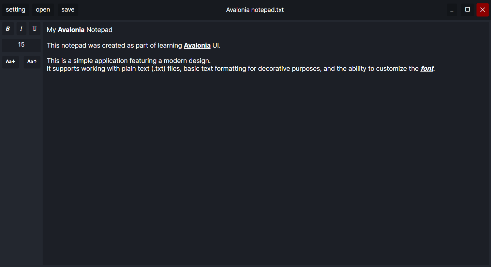

# Avalonia Notepad

This is a simple notepad application built with [Avalonia UI](https://avaloniaui.net/).  
It features a clean, modern interface with support for dark mode and basic text formatting.

## Features

- Modern design.
- Open and save `.txt` files
- Basic text formatting with symbols (`*bold*`, `_italic_`, `^underline^`)

## Screenshots

